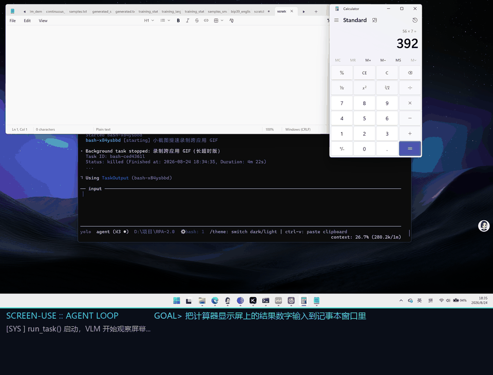
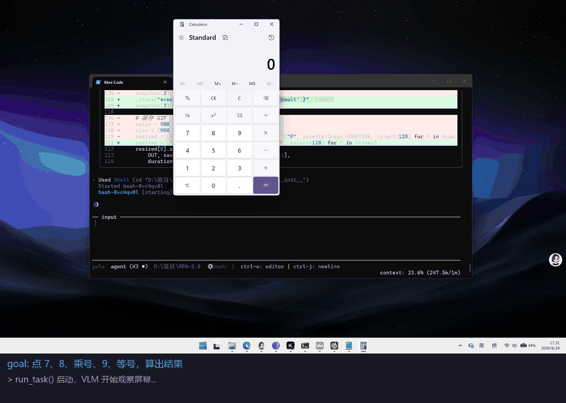
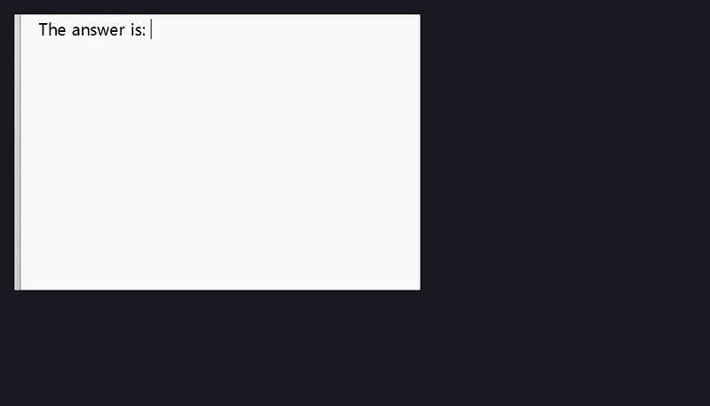
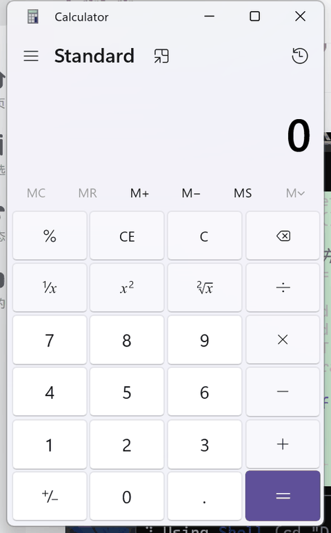

# 🖥️ screen-use

**browser-use, but for the entire desktop.**

Give any AI Agent eyes 👀 and hands 🖐️ on Windows — let Claude, Kimi, Cursor or your own agent see the screen, find UI elements, and operate *any* desktop app through natural language. No selectors. No scripts that break when the UI changes.

[](LICENSE)
[](https://www.python.org)
[]()
[](https://modelcontextprotocol.io)



> 👆 *Cross-app autonomy: the agent reads the result from Calculator, activates Notepad, and types it in — every step decided by the VLM watching the screen (see the live thought stream at the bottom).*

<details>
<summary>🎬 More demos</summary>

Single-app agent loop (VLM computes 78 × 9 by itself):



Scripted cross-app (Calculator → Notepad):



Single-app precision clicking:



</details>

## Why

Traditional RPA records selectors — and breaks the moment a page changes. [browser-use](https://github.com/browser-use/browser-use) (32k⭐) solved this for **browsers**. **screen-use** brings the same idea to **the entire desktop**: Excel, SAP clients, ERP software, even legacy Win32 programs.

| | Traditional RPA | screen-use |
|---|---|---|
| Locating elements | Recorded selectors, break easily | Understands UI via Accessibility tree + Vision models |
| Scope | Browser or specific apps only | **Any** desktop app |
| Authoring | Professional developers | Natural language |
| Cost | Expensive enterprise software | Open source, local-model friendly |

## How it works

```
Your Agent (Claude / Kimi / Cursor / custom)   ← does the planning
        │  MCP or Python SDK
        ▼
┌─────────────────────────────────────────────┐
│ screen-use                                  │
│  Visual Loop ──► observe→think→act→verify   │
│  Introspection──► difficulty playbook        │
│  Meta-learning──► experience & vocab memory  │
│  Perception ──► UIA tree + screenshots (SoM)│
│  Locating   ──► strategy chain:             │
│                 ⓪ learned vocab mapping     │
│                 ① UIA text match (0 cost)   │
│                 ② Set-of-Mark + VLM         │
│  Action     ──► mouse / keyboard            │
└─────────────────────────────────────────────┘
```

**VLM is optional, not required.** The locating strategy chain hits most targets with pure Accessibility-tree text matching — zero model calls, millisecond latency. A vision model (cloud or local via Ollama) only kicks in for UIA-blind UIs.

## Capabilities at a glance

- 👀 **Sees** — full-screen screenshots with Set-of-Mark annotation, plus the live UIA accessibility tree (150 controls, foreground-window priority, ~0.1s per scan)
- 🖐️ **Acts** — pixel-precise mouse/keyboard, batch action sequences in one call, and direct control text read/write via UIA ValuePattern (works even where clipboard paste is blocked)
- 🧠 **Thinks** — autonomous observe→think→act→verify loop with an introspection playbook (classifies *why* it's stuck and changes strategy) and meta-learning memory that makes repeat tasks faster over time
- 🔌 **Plugs in** — 18 MCP tools instantly available to any MCP host (Kimi CLI, Claude Desktop, Cursor), or a 3-line Python SDK
- 💰 **Model-optional** — UIA-first locating means most actions need zero model calls; local Ollama VLMs keep the whole perceive→act loop on-device
- 🛡️ **Safe** — `dry_run` simulation, per-action `confirm_callback`, and a slam-to-corner failsafe
- 🌐 **Field-tested** — drove a real academic journal submission end-to-end (Papercept + ORCID + OAuth binding, 30+ steps) in a live browser with zero selectors

## Quickstart

```bash
git clone https://github.com/tongriyaotxt/screen-use.git
cd screen-use
pip install -r requirements.txt
```

### As a Kimi CLI plugin (recommended)

One command — Kimi instantly gets all 18 desktop tools:

```bash
kimi mcp add --transport stdio screen-use -- <path-to-python.exe> -m screen_use.mcp_server
kimi mcp test screen-use   # verify the connection
```

Optionally install the bundled usage-strategy skill, which teaches Kimi the optimal tool-selection playbook:

```bash
mkdir -p ~/.kimi/skills/screen-use && cp skills/screen-use/SKILL.md ~/.kimi/skills/screen-use/
```

Then just tell Kimi: *"Open Calculator and compute 123 × 456"* or *"Read what's in my Notepad"*.

### As a generic MCP Server

Add to `claude_desktop_config.json` (or any MCP-compatible agent's config):

```json
{
  "mcpServers": {
    "screen-use": {
      "command": "python",
      "args": ["-m", "screen_use.mcp_server"],
      "cwd": "path/to/screen-use"
    }
  }
}
```

Then just tell your agent: *"Open Calculator and compute 123 × 456."*

### As a Python SDK

```python
from screen_use import ScreenUse

tools = ScreenUse()

tools.click_element("Save")            # locate + click, one call
tools.type_text("Hello, 你好")          # Unicode-safe (clipboard paste)
tools.hotkey("ctrl", "s")

# Atomic tools for vision-capable agents:
elements = tools.list_ui_elements()    # id, name, type, bbox — no model needed
shot = tools.screenshot(annotate=True) # Set-of-Mark annotated screenshot
tools.click(500, 300)
```

## Autonomous task loop

One call, full autonomy — the agent sees, decides, acts and self-corrects:

```python
tools.run_task("打开计算器，算 25 乘以 4")   # observe → think → act → verify
```

**Introspection (困难分类反思)**: when the loop gets stuck, it classifies the difficulty — *no effect / repeat loop / consecutive failures / missing elements / unexpected popup* — and reflects with a targeted prompt playbook, then adjusts strategy.

**Meta-learning (元学习)**: successful runs are remembered. Similar past tasks are recalled as experience hints, and learned vocabulary mappings (e.g. "乘号" → `Multiply by`) become the strategy chain's new first level. It literally gets better the more you use it. Memory lives in `~/.screen_use/`.

## Tools (18)

**Atomic** (zero model dependency): `screenshot` · `list_ui_elements` · `click` · `click_scaled` · `double_click` · `right_click` · `click_element_id` · `type_text` · `hotkey` · `press` · `scroll` · `get_element_text` · `set_element_text`

**Batch**: `do_actions` — execute a whole sequence (click → type → Tab → Enter) in one call, one screenshot at the end

**High-level**: `find_element` (strategy-chain locating) · `click_element` (locate + click) · `read_screen` (VLM screen Q&A) · `run_task` (autonomous visual loop)

## Vision model (optional)

Only needed when your agent has no vision AND the target app is UIA-blind. Copy `.env.example` to `.env`:

| Preset | Config | Models |
|---|---|---|
| Kimi Code subscription | `VISION_PROVIDER=kimi-code` | kimi-for-coding (reuses your Kimi CLI OAuth login — token auto-refreshes, zero extra cost) |
| Local (free, private) | `VISION_PROVIDER=ollama` | qwen3-vl, qwen2.5vl, llama3.2-vision |
| OpenAI | `VISION_PROVIDER=openai` + key | gpt-4o |
| Qwen | `VISION_PROVIDER=qwen` + key | qwen-vl-max |

Without any VLM configured, atomic tools and UIA matching still work fully.

## Field-tested on real websites

No toy demos here. screen-use has driven a **real academic journal submission** end-to-end — inside a live browser, with zero selectors:

- 📄 **Papercept** (Automatica's submission system): registered an author PIN, navigated the duplicate-record review list, set the password via an emailed one-time code
- 🆔 **ORCID**: completed the full 5-step registration — handled the cookie-consent modal, dismissed browser password popups, and when the confirm-email field **blocked clipboard paste**, the agent fell back to typing the address key by key
- 🔗 **OAuth binding**: authorized PaperCept to read the ORCID record, accepted terms, filled the multi-screen personal-info form (dropdowns included)

Every step was: screenshot → reason → `click` / `type_text` / `press` / `scroll` → verify. Web pages are UIA-blind, so this run exercised the raw-coordinate path the whole way — exactly the worst-case scenario for desktop automation.

## Speed notes (2026-08 update)

A full real-world run (30+ step web-form submission) exposed the bottlenecks; this release fixes them:

- **Screenshots never blow up the context**: JPEG output auto-degrades quality to stay under 90KB (per-call `max_size`/`quality` overrides)
- **Batch, don't ping-pong**: `do_actions` runs a whole action sequence in one MCP call; `run_task` can plan multiple actions per VLM step
- **UIA does the reading**: `get_element_text` / `set_element_text` read and write control text directly (ValuePattern), bypassing paste-blocked input fields entirely — no more key-by-key fallback
- **No mental math**: `click_scaled` accepts coordinates straight from the annotated screenshot
- **Faster primitives**: `pyautogui.PAUSE` 0.05→0.02, clipboard backup/restore, paste verification, BILINEAR resize, reused mss instance, VLM `timeout=60` + smaller `max_tokens`

## Safety

- 🚨 **Failsafe**: slam your mouse to the top-left corner to abort instantly
- ✅ `confirm_callback` hook to approve every action (SDK)
- 🧪 `ScreenUse(dry_run=True)` records actions without executing

## Extensibility

screen-use is designed as a set of replaceable layers — every tier can be extended without touching the core:

| Layer | Extension point | How |
|---|---|---|
| **Vision model** | `VisionProvider` ABC | Implement `pick_element()` + `ask_about_screen()` (2 methods) — any OpenAI-compatible endpoint works out of the box via `.env` |
| **Tools** | SDK facade | Add a method to `ScreenUse` → expose in `mcp_server.py` with one `@mcp.tool()` decorator |
| **Locating** | Strategy chain | Insert your own level (e.g. OpenCV template matching) in `find_element()` — earlier levels win |
| **Actions** | `Executor` | Add drag, IME input, global hotkey hooks... `dry_run` support comes free |
| **Platform** | `perception/` seam | Port `uia_tree.py` + `screen.py` to macOS Accessibility API or Linux AT-SPI — the rest of the stack is platform-agnostic |
| **Memory** | `ExperienceStore` | Swap JSONL for SQLite/vector DB; the meta-learning loop only depends on `record_trace/recall/learn_mapping/recall_mapping` |
| **Introspection** | `reflect.py` playbook | Add a `StuckType` + prompt template; classification is pure functions, easy to unit test |
| **Host agents** | MCP | Any MCP-compatible host (Claude, Kimi CLI, Cursor, your own) gets all 18 tools instantly |

Safety hooks are part of the interface too: `confirm_callback` for human-in-the-loop approval, `dry_run` for simulation, PyAutoGUI failsafe for emergency stop.

## Roadmap

- [x] UIA + SoM locating strategy chain
- [x] MCP Server (18 tools)
- [x] Batch actions + UIA text read/write + context-safe screenshots (speed overhaul)
- [x] Local VLM support (Ollama)
- [x] Kimi Code subscription as VLM backend (OAuth, auto-refreshing token)
- [x] Autonomous visual loop (`run_task`)
- [x] Introspection playbook & meta-learning memory
- [ ] `wait_for_element` / auto-verification primitives
- [ ] **Experience replay: compile successful traces into parameterized skill macros** (semantic anchors + checkpoints + VLM fallback) — design: [research/experience-replay](research/experience-replay/DESIGN.md)
- [ ] Drag & drop
- [ ] VLM raw-coordinate fallback + OpenCV template matching (UIA-blind apps)
- [ ] macOS (Accessibility API) & Linux support
- [ ] PyPI release

## Where it's headed

The long-term bet: **GUIs were built for humans — agents shouldn't need APIs to use software.** screen-use aims to be the open desktop action layer for the agent era.

- **Any agent, any app.** MCP is becoming the USB-C of agent tooling, and the accessibility tree is the closest thing to a universal UI protocol. Combined, any MCP-compatible agent can operate *any* desktop software — including the legacy line-of-business apps (SAP GUI, bank and hospital terminals, old ERPs) that will never ship an API. That's a huge, underserved surface traditional RPA monetizes at enterprise prices; screen-use makes it free and agent-native.
- **From automation to delegation.** The meta-learning memory turns repeated tasks into near-deterministic runs. The endgame isn't scripting steps — it's describing an outcome (*"file my expense report"*, *"reconcile this spreadsheet against the ERP export"*) and trusting the loop.
- **Local-first privacy.** Screen content is the most sensitive data there is. With local VLMs (Ollama) and the UIA-first strategy chain, the entire perceive→decide→act loop can run without a single byte leaving the machine.
- **Cross-platform by design.** The only Windows-specific code is the perception seam (`uia_tree.py` + `screen.py`); macOS Accessibility API and Linux AT-SPI ports slot into the same interface.

Contributions welcome — see issues for good first tasks.

## Development

```bash
pytest tests -q                        # 97 unit tests, no desktop/VLM needed
python examples/demo_calculator.py     # end-to-end demo (real clicks!)
python examples/mcp_client_demo.py     # MCP handshake + tool list
```

## License

MIT

---

<details>
<summary>🇨🇳 中文说明</summary>

**screen-use = 桌面版 browser-use**：让任何 AI Agent 获得看屏幕、操作桌面应用的能力。

- **不是传统 RPA**：不录制 selector，通过无障碍树 + 视觉模型理解 UI，界面变了也不怕
- **跨一切桌面应用**：Excel、SAP、ERP 客户端、老旧 Win32 程序
- **自然语言驱动**：`click_element("保存按钮")` 一句话搞定
- **VLM 可选**：策略链第一级是纯 UIA 文本匹配（零模型、毫秒级），视觉模型只在盲区兜底，支持本地 Ollama 保护隐私，也可直接复用 Kimi Code 订阅（`VISION_PROVIDER=kimi-code`，OAuth 免配置）
- **真实场景验证**：曾在真实浏览器中驱动学术期刊投稿全流程（Papercept 注册 + ORCID 五步注册 + OAuth 绑定），遇禁粘贴表单自动降级逐键输入
- **能力一览**：截图 + UIA 无障碍树双感知；鼠标键盘原子动作 + 批量动作 + 控件文本直读直写；自主观察-决策-执行-验证闭环，带困难分类反思和元学习记忆；`dry_run` 模拟 + 逐动作确认 + 紧急中止
- **未来方向**：成为 Agent 时代的开放桌面操作层——任何 MCP 宿主操作任何桌面软件（含永远没有 API 的老旧业务系统）；元学习让重复任务趋于确定性执行，从"自动化"走向"委托"；本地 VLM 保证屏幕数据不出机；感知层是唯一平台相关代码，macOS / Linux 移植已在路线图上

接入方式、工具列表、安全配置与上文英文版一致。

</details>
